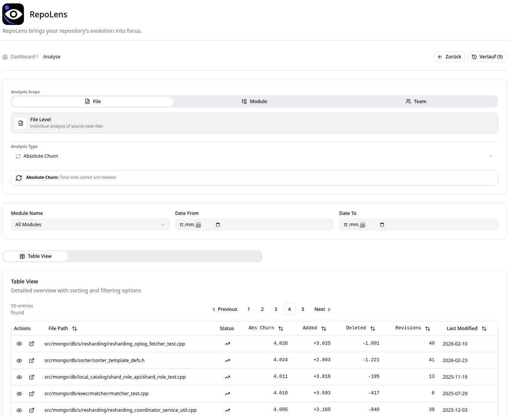

  

  # RepoLens

  **From Code to Clarity: Master Your Software Evolution & Team Dynamics.**

  
    

---

## Overview

**RepoLens** is an advanced repository analytics platform that extracts and interprets version control metadata to uncover software evolution patterns, code quality risks, and team interaction dynamics.

By bridging the gap between raw Git history and actionable insights, RepoLens empowers engineering teams to manage technical debt proactively, optimize their architecture, and improve collaboration.

---

## Key Features

RepoLens provides a multi-dimensional view of your software project across **Files**, **Modules**, and **Teams**:

### Evolution & Pulse
* **Change Frequency:** Understand where development effort is concentrated by tracking commit density over time.
* **Development Trend:** Compare historical baselines with current activity to see if components are "Spiking," "Cooling," or "Stable."
* **Activity Recency:** Quickly spot abandoned legacy code versus areas of intense recent development.
* **Absolute Churn:** Analyze the raw volume of changes (added/deleted lines) to find highly unstable components.

### Quality & Risk
* **Hotspot Analysis:** Identify critical problem areas by combining Code Churn (activity) with File Age (longevity of changes). Pinpoint your biggest sources of technical debt.
* **Module Hotspot Trends:** See which architectural components are heating up or cooling down from a risk perspective.

### Structure & Logic
* **Combined Complexity:** A holistic view combining *Cyclomatic Complexity* (branching), *Cognitive Complexity* (readability), and structural *Effort* to pinpoint exactly where code is hardest to maintain.
* **Complexity Trends:** Track if recent development is making your code more complex (accumulating debt) or simpler (successful refactoring).

### Team & Knowledge (Conway's Law in Action)
* **Code Ownership:** Identify primary knowledge carriers and single points of failure (Bus Factor) for any given file or module.
* **Knowledge Fragmentation:** Discover components modified by too many distinct developers, indicating a lack of ownership or communication overhead.
* **Module Ownership by Teams:** Visualize which teams effectively "own" which architectural components.
* **Top Team Contributors:** Identify which teams are actively driving the development of specific modules to align architecture with team topology.

### Base Metrics
* **Lines of Code (LOC):** Track physical size to identify massive "God Objects" violating the Single Responsibility Principle.

---

##  Quick Start

RepoLens is distributed as a set of pre-built Docker containers, making it easy to deploy without needing to build from source.

1. **Download the Release:** Get the latest `docker-compose.yml`, `manage.sh`, and configuration templates from our releases page.
2. **Configure:** Edit the `config/config.yaml` to point to your repository and define your modules.
3. **Analyze:** Run `./manage.sh import` to analyze your repository history.
4. **Refresh:** Run `./manage.sh refresh` to bring analysis in place.
5. **Launch:** Run `./manage.sh up` to start the dashboard.

Open your browser at **`http://localhost`** to explore your data.

---

## Dashboard Preview

  

## Comprehensive Documentation

For detailed guides on deploying RepoLens, configuring your analysis, managing the database lifecycle (including zero-downtime updates), and interpreting the metrics, please visit our official documentation:

👉 **[RepoLens Official Documentation](https://github.com/ibrl/RepoLens/wiki)**

---

## Feedback, Bugs & Feature Requests

RepoLens is actively evolving, and your feedback is highly appreciated!

If you encounter any issues, discover a bug, or have a great idea for a new analysis feature, please let us know. We welcome all feedback to make this tool better for everyone.

👉 **[Open an Issue on our GitHub Tracker](https://github.com/khreichel/RepoLens/issues)**

When reporting bugs, please provide as much context as possible (steps to reproduce, logs, or error messages). For feature requests, describe the use case and how it would benefit your workflow.

---

##  Terms of Use & Disclaimer

RepoLens is distributed as free-to-use Docker containers. You are welcome to deploy and use the provided images for your own projects.

**Disclaimer of Warranty:**
THE SOFTWARE IS PROVIDED "AS IS", WITHOUT WARRANTY OF ANY KIND, EXPRESS OR IMPLIED, INCLUDING BUT NOT LIMITED TO THE WARRANTIES OF MERCHANTABILITY, FITNESS FOR A PARTICULAR PURPOSE AND NONINFRINGEMENT. IN NO EVENT SHALL THE AUTHORS OR COPYRIGHT HOLDERS BE LIABLE FOR ANY CLAIM, DAMAGES OR OTHER LIABILITY, WHETHER IN AN ACTION OF CONTRACT, TORT OR OTHERWISE, ARISING FROM, OUT OF OR IN CONNECTION WITH THE SOFTWARE OR THE USE OR OTHER DEALINGS IN THE SOFTWARE. USE AT YOUR OWN RISK.
